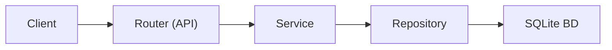

# Project Structure — Night Sky Viewer

## Objectif

Ce skill encode la structure et l'architecture du projet pour guider toute
création de fichier, ajout de feature ou refactoring. Il est déclenché
automatiquement quand on me demande de créer un nouveau fichier, composant,
endpoint, ou de comprendre l'organisation du projet.

---

## Vue d'ensemble

```
Projet-POO/
├── .agent/                    ← Skills et workflows pour l'agent IA
│   ├── skills/
│   └── workflows/
├── Plan/                      ← Documentation projet et planning
│   └── Plan.md
├── docs/                      ← Documentation technique
├── backend/                   ← API Python / FastAPI
│   ├── app/                   ← Code source principal
│   │   ├── api/               ← Routers FastAPI (endpoints)
│   │   ├── models/            ← Modèles SQLAlchemy (ORM)
│   │   ├── schemas/           ← Schémas Pydantic (validation)
│   │   ├── services/          ← Logique métier
│   │   ├── repositories/      ← Accès données (queries BD)
│   │   ├── config.py          ← Configuration (depuis .env)
│   │   ├── database.py        ← Setup SQLAlchemy
│   │   └── main.py            ← Point d'entrée FastAPI
│   ├── data/                  ← Données brutes (CSV étoiles)
│   ├── scripts/               ← Scripts d'import BD
│   ├── tests/                 ← Tests PyTest
│   ├── Dockerfile
│   ├── requirements.txt
│   └── .env
├── frontend/                  ← React / Vite / Three.js
│   ├── src/
│   │   ├── components/        ← Composants React
│   │   ├── App.tsx            ← Composant racine
│   │   └── main.tsx           ← Point d'entrée
│   ├── public/
│   │   └── textures/          ← Textures Terre (WebP)
│   ├── package.json
│   └── vite.config.ts
├── docker-compose.yml         ← Orchestration des services
├── pyrightconfig.json         ← Config type-checking Python
├── .gitignore
└── README.md
```

---

## Pattern architectural backend



### Règles strictes

| Couche                           | Responsabilité                  | Peut appeler    | NE PEUT PAS appeler |
| -------------------------------- | ------------------------------- | --------------- | ------------------- |
| **Router** (`api/`)              | HTTP, validation, sérialisation | Service         | Repository, BD      |
| **Service** (`services/`)        | Logique métier, calculs         | Repository      | BD directement      |
| **Repository** (`repositories/`) | Queries BD, CRUD                | BD (SQLAlchemy) | —                   |
| **Schema** (`schemas/`)          | Validation entrée/sortie        | —               | —                   |
| **Model** (`models/`)            | Structure ORM des tables        | —               | —                   |

---

## Ajouter une nouvelle feature

### Nouvel endpoint API (ex: "Météo")

1. **Modèle** → `backend/app/models/weather.py`

   ```python
   class Weather(Base):
       __tablename__ = "weather"
       ...
   ```

2. **Schema** → `backend/app/schemas/weather.py`

   ```python
   class WeatherResponse(BaseModel):
       ...
   ```

3. **Repository** → `backend/app/repositories/weather_repository.py`

   ```python
   class WeatherRepository:
       def get_all(self, db: Session) -> list[Weather]:
           ...
   ```

4. **Service** → `backend/app/services/weather_service.py`

   ```python
   class WeatherService:
       def __init__(self, repository: WeatherRepository):
           ...
   ```

5. **Router** → `backend/app/api/weather.py`

   ```python
   router = APIRouter(prefix="/api/weather", tags=["weather"])
   ```

6. **Enregistrer** → `backend/app/main.py`

   ```python
   app.include_router(weather.router)
   ```

7. **Tests** → `backend/tests/test_weather.py`

### Nouveau composant React

1. Créer `frontend/src/components/NomComposant.tsx`
2. Typer les props avec une interface TypeScript
3. Importer et utiliser dans `App.tsx` ou le parent approprié

---

## Conventions de nommage

| Élément          | Convention | Exemple                   |
| ---------------- | ---------- | ------------------------- |
| Fichiers Python  | snake_case | `observation_point.py`    |
| Classes Python   | PascalCase | `ObservationPoint`        |
| Fonctions Python | snake_case | `get_visible_stars()`     |
| Fichiers React   | PascalCase | `Globe.tsx`               |
| Composants React | PascalCase | `<Globe />`               |
| Endpoints API    | kebab-case | `/api/observation-points` |
| Tables BD        | snake_case | `observation_point`       |
| Variables JS/TS  | camelCase  | `starCount`               |

---

## Ports et URLs

| Service        | Port | URL                          |
| -------------- | ---- | ---------------------------- |
| Backend (dev)  | 8000 | `http://localhost:8000`      |
| Frontend (dev) | 5173 | `http://localhost:5173`      |
| API docs       | 8000 | `http://localhost:8000/docs` |
