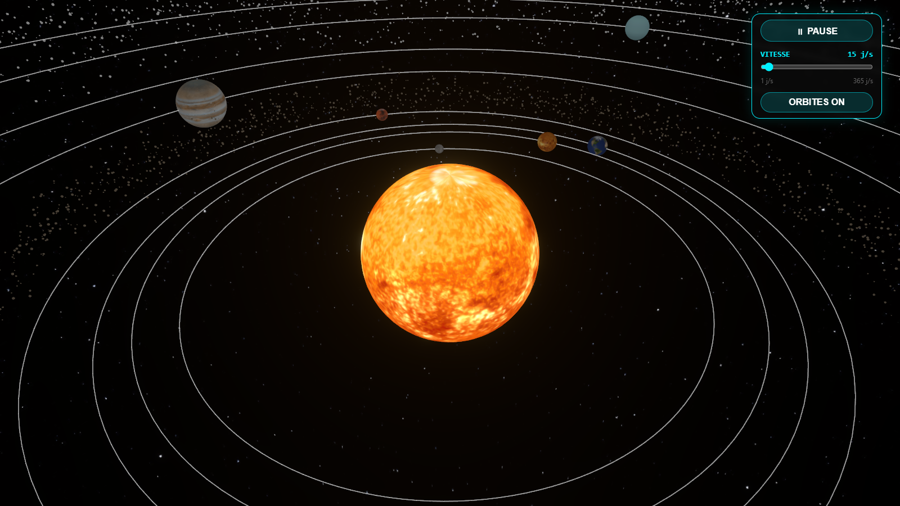
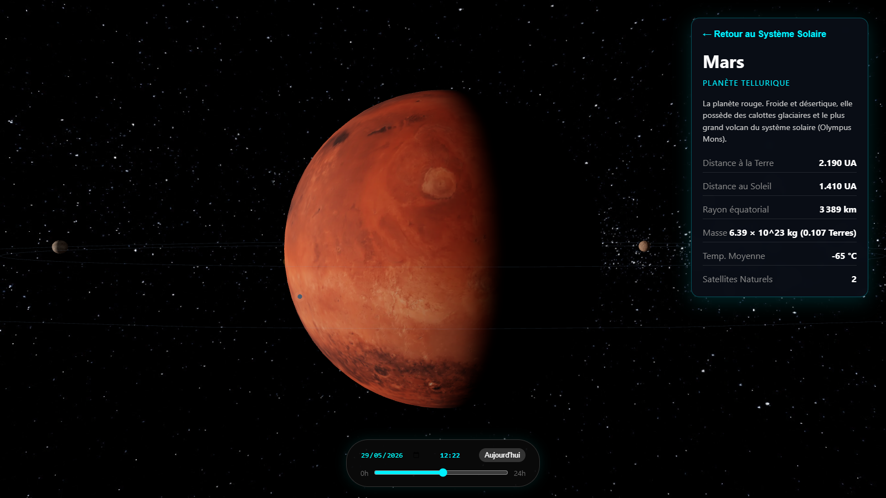
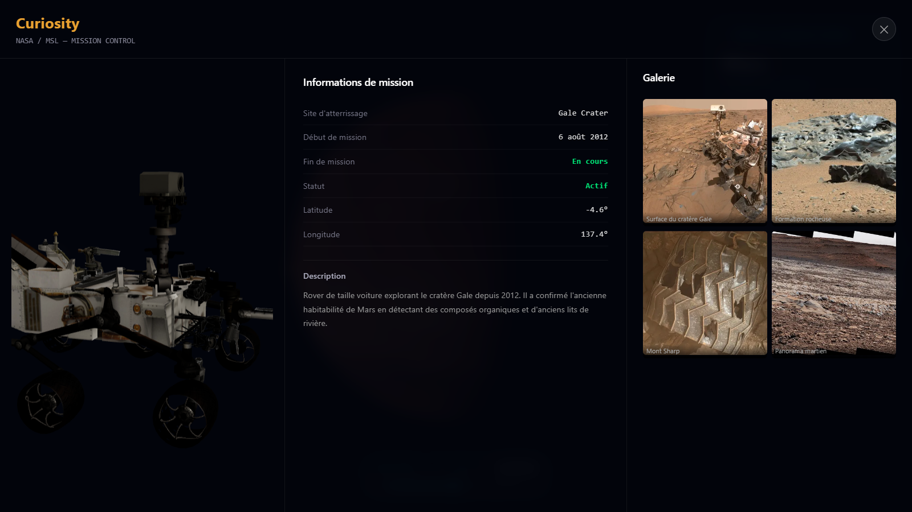
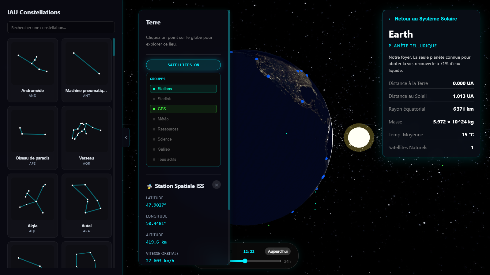
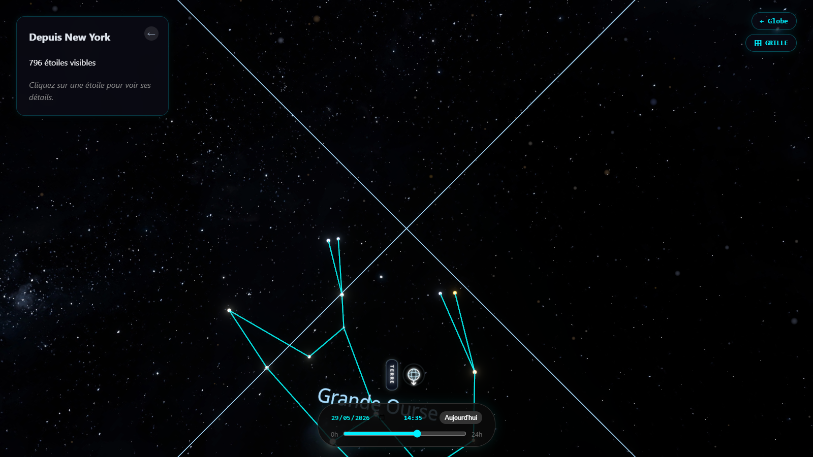

# Night Sky Viewer

Application web 3D d'exploration astronomique : visualisation du ciel nocturne géolocalisé, du système solaire et de la Terre en orbite, à n'importe quelle date passée ou future.

**Démo en ligne :** https://projet-poo.vercel.app/
**Dépôt :** https://github.com/hugo-bdnl/Projet-POO

---

## 1. Présentation du projet

### Description

Night Sky Viewer est une application _fullstack_ (Python + TypeScript) qui permet d'explorer le ciel sous trois angles complémentaires, depuis un navigateur :

- **le système solaire** vu de l'extérieur (Soleil, 8 planètes, lunes, ceintures d'astéroïdes et de Kuiper) ;
- **une planète en détail** (globe 3D texturé avec terminateur jour/nuit, ISS et satellites en orbite réelle, rovers martiens) ;
- **le ciel nocturne** tel qu'on le verrait depuis un lieu précis de la Terre, à une date donnée (plus de 100 000 étoiles, 88 constellations).

L'utilisateur choisit un lieu d'observation et un instant ; l'application calcule alors la position réelle des astres et reconstitue la voûte céleste correspondante.

### Problème adressé

Comprendre « ce qu'on voit dans le ciel et pourquoi » demande de jongler avec des coordonnées célestes (ascension droite / déclinaison), la rotation terrestre et la date d'observation. Ces notions restent abstraites tant qu'on ne les visualise pas.
Night Sky Viewer répond à ce besoin : il transforme des calculs astronomiques exacts en une scène 3D interactive, où l'on peut littéralement _déplacer le temps_ et _changer de lieu_ pour voir l'effet sur le ciel. Le projet relie donc une logique de calcul sérieuse (côté Python) à une restitution visuelle immédiate (côté navigateur).

### Public cible

- Curieux et amateurs d'astronomie souhaitant repérer une constellation depuis chez eux ;
- Étudiants et enseignants pour illustrer les coordonnées célestes, la mécanique orbitale et la rotation terrestre ;
- Toute personne voulant explorer le système solaire ou suivre la position de l'ISS et des satellites de façon ludique.

---

## 2. Fonctionnalités

### Fonctionnalité centrale

Calcul et affichage en temps réel du ciel visible depuis un lieu et un instant donnés. Concrètement : à partir d'une latitude, d'une longitude et d'un horodatage, le backend transforme les coordonnées équatoriales (RA/Dec, catalogue J2000) de chaque étoile en coordonnées horizontales (azimut / altitude) pour l'observateur, ne renvoie que les étoiles au-dessus de l'horizon, et le frontend les place sur une voûte céleste 3D.

### Les trois modes de vue

| Mode                | Description                                                                                                                                                                                                                        |
| ------------------- | ---------------------------------------------------------------------------------------------------------------------------------------------------------------------------------------------------------------------------------- |
| **Système solaire** | Soleil, 8 planètes positionnées par éphémérides, orbites elliptiques, plus de 20 lunes, ceintures d'astéroïdes et de Kuiper. Rotation automatique réglable.                                                                        |
| **Globe**           | Une planète en gros plan, texturée, avec shader de terminateur jour/nuit. Pour la Terre : ISS et satellites (Starlink, GPS, météo…) propagés en orbite réelle, marqueur du lieu d'observation. Pour Mars : marqueurs des 5 rovers. |
| **Ciel nocturne**   | Vue à la première personne depuis le sol. Étoiles colorées selon leur type spectral, Voie lactée, grille azimut/altitude, boussole, tracé des constellations.                                                                      |

### Détail des fonctionnalités

- **Recherche de constellation et meilleur point d'observation.** On cherche une constellation parmi les 88 ; l'application calcule, parmi 50 lieux d'observation de référence, celui où elle culmine le plus haut à l'instant choisi, puis trace son dessin dans le ciel.
- **Curseur temporel (Time Slider).** Réglage libre de la date et de l'heure ; toute la scène (étoiles, planètes, lunes, ISS) se recalcule en conséquence.
- **ISS et satellites en temps réel.** Position propagée côté client par modèle SGP4 à partir des données TLE officielles (CelesTrak), relayées et mises en cache par le backend.
- **Rovers martiens.** Positions des 5 rovers (Curiosity, Perseverance, Opportunity, Spirit, Zhurong) servies par le backend, avec un panneau « Mission Control » au clic.
- **Fiches d'information.** Au clic sur une étoile, une planète, l'ISS ou un rover, un panneau latéral affiche ses caractéristiques.

### Améliorations et bonus (au-delà des exigences minimales)

- **Interface web 3D complète** (WebGL via Three.js), responsive desktop et mobile (panneau « bottom sheet » sur petit écran).
- **API REST documentée automatiquement** (Swagger UI sur `/docs`).
- **Système de cache à plusieurs niveaux** côté backend (positions d'étoiles 10 min, données statiques 24 h, TLE 12 h) pour limiter les recalculs et le _rate-limiting_ des sources externes.
- **Calculs vectorisés** (NumPy / AstroPy) : toutes les étoiles transformées en un seul appel, sans boucle Python.
- **Conteneurisation** (`docker-compose` backend + frontend) et **déploiement continu** (push sur `main` → Render + Vercel).
- **Effets visuels** : post-processing bloom, apparition progressive des objets célestes, shaders personnalisés.

---

## 3. Installation et lancement

### Accès le plus simple : en ligne

L'application est déployée et accessible sans installation : **https://projet-poo.vercel.app/**

> Le backend est hébergé sur l'offre gratuite de Render, qui met le service en veille après ~15 min d'inactivité. La toute première requête peut donc prendre 30 à 60 secondes (démarrage à froid), puis tout redevient fluide.

### Prérequis pour une installation locale

- Python 3.12+
- Node.js 20+ et npm
- (Optionnel) Docker et Docker Compose

### Option A — Lancement manuel

**Backend** (dans `backend/`) :

```bash
python -m venv venv
venv\Scripts\activate        # Windows
# source venv/bin/activate   # Linux / macOS
pip install -r requirements.txt
uvicorn app.main:app --reload
```

Le serveur démarre sur http://localhost:8000 (documentation interactive sur http://localhost:8000/docs). La base SQLite est créée automatiquement au premier démarrage.

**Frontend** (dans `frontend/`) :

```bash
npm install
npm run dev
```

L'interface est servie sur http://localhost:5173.

### Option B — Docker (tout-en-un)

Depuis la racine du projet :

```bash
docker-compose up
```

Backend sur le port 8000, frontend sur le port 5173.

---

## 4. Tests

Le projet inclut une suite de tests unitaires et de scénarios automatisés.

**Tests backend** (PyTest) — depuis la racine :

```bash
python -m pytest -v
python -m pytest --cov=backend/app --cov-report=term-missing   # avec couverture
```

Ils couvrent notamment :

- les 50 points d'observation (comptage, qualité des coordonnées, lieux connus, endpoints) ;
- les 88 constellations (comptage IAU, validité du JSON des tracés, associations étoiles) ;
- le catalogue d'étoiles et les endpoints associés ;
- le service astronomique (transformation RA/Dec → Az/Alt) et le service de cache.

**Tests frontend** (Vitest) — depuis la racine :

```bash
npx vitest run
```

---

## 5. Exemples d'utilisation

> Le plus parlant reste de tester l'application en ligne : **https://projet-poo.vercel.app/**

### Vidéo de démonstration

Une vidéo qui déroule le parcours complet (système solaire, Mars et ses rovers, retour, Terre, satellites/ISS, ciel nocturne et constellations) est disponible ici : [`docs/media/demo-complete.webm`](docs/media/demo-complete.webm).

### Parcours illustré

**1. Système solaire et réglage de la vitesse de simulation.** À l'accueil, le système solaire tourne automatiquement ; un curseur permet de régler la vitesse (de 1 à 365 jours par seconde) et d'afficher ou masquer les orbites.



**2. Vue planétaire — Mars.** Un clic sur une planète zoome dessus. Sur Mars, les marqueurs des rovers apparaissent ; le panneau de droite résume les caractéristiques de la planète.



**3. Clic sur un rover.** Sélectionner un rover ouvre l'overlay « Mission Control » : modèle 3D, fiche de mission (site, dates, position, statut) et galerie photo.



**4. Vue planétaire — Terre, avec satellites et ISS.** Après retour au système puis zoom sur la Terre (terminateur jour/nuit, lumières des villes côté nuit), on peut afficher les satellites en orbite réelle et sélectionner l'ISS pour lire sa télémétrie (altitude, vitesse, position).



**5. Ciel nocturne et constellations.** Choisir une constellation envoie l'utilisateur au meilleur lieu d'observation et bascule en vue ciel à la première personne, où le tracé de la constellation est dessiné parmi les étoiles réellement visibles.



> Le curseur temporel, présent en bas de l'écran, fait évoluer en direct le ciel et la position des astres (lever/coucher d'étoiles, déplacement des planètes).

### Exemple d'appel API

L'API est utilisable directement. Exemple : étoiles visibles depuis Paris maintenant.

```bash
curl "http://localhost:8000/api/stars/visible?lat=48.86&lon=2.35&mag_limit=5"
```

```json
[
  {
    "proper_name": "Sirius",
    "magnitude": -1.46,
    "constellation_abbr": "CMA",
    "azimuth": 178.43,
    "altitude": 42.1
  }
]
```

---

## 6. Architecture et choix techniques

### Vue d'ensemble

```
Frontend (React + Three.js)  --HTTP/JSON-->  Backend (FastAPI)  -->  SQLite
   Vercel                                       Render
```

La répartition des calculs est volontaire : les **calculs lourds et catalogués** (transformation de 100 000+ étoiles, recherche du meilleur lieu d'observation) sont faits **côté backend** avec AstroPy vectorisé ; les **calculs légers et continus** (positions des planètes, de l'ISS, des satellites, mis à jour à 60 images/s) sont faits **côté frontend** pour rester fluides sans aller-retour réseau.

### Backend — architecture 4 couches stricte

```
Router (app/api/)  ->  Service (app/services/)  ->  Repository (app/repositories/)  ->  SQLite
```

Chaque couche a une responsabilité unique : le **Router** gère le HTTP et la validation Pydantic, le **Service** porte la logique métier et les calculs, le **Repository** isole tous les accès à la base. Cette séparation rend le code testable (on peut tester un service sans serveur HTTP) et facile à faire évoluer.

| Couche                         | Rôle                                      |
| ------------------------------ | ----------------------------------------- |
| `app/api/`                     | Endpoints HTTP, validation, sérialisation |
| `app/services/`                | Logique métier, calculs AstroPy, cache    |
| `app/repositories/`            | Requêtes SQLAlchemy, accès BD exclusif    |
| `app/models/` · `app/schemas/` | ORM et schémas de validation (passifs)    |

### Frontend

Single Page Application React 19 + TypeScript. Le rendu 3D repose sur Three.js, encapsulé par React Three Fiber (description déclarative de la scène) et Drei (utilitaires). L'état global est géré par des stores Zustand atomiques (mode de vue, étoiles, sélection…). Les trois modes de vue sont mutuellement exclusifs et pilotés par un seul champ d'état.

### Justification des principales librairies

| Choix                         | Pourquoi                                                                                                                                                 |
| ----------------------------- | -------------------------------------------------------------------------------------------------------------------------------------------------------- |
| **FastAPI**                   | Validation automatique via Pydantic, documentation Swagger générée, support asynchrone (proxy ISS / satellites).                                         |
| **AstroPy + NumPy**           | Standard scientifique pour les conversions de coordonnées ; la vectorisation évite des boucles Python coûteuses sur des dizaines de milliers d'étoiles.  |
| **SQLite**                    | Catalogue stellaire essentiellement en lecture seule : une base fichier suffit, zéro configuration, déploiement simplifié.                               |
| **React Three Fiber**         | Permet d'écrire une scène Three.js en composants React, avec gestion du cycle de vie et des ressources GPU.                                              |
| **astronomia / satellite.js** | Calculs planétaires (algorithmes de Meeus / VSOP87) et propagation SGP4 directement dans le navigateur, pour une animation continue sans latence réseau. |
| **Zustand**                   | Gestion d'état minimaliste, sans la lourdeur de Redux, adaptée à des mises à jour fréquentes.                                                            |

La structure du projet est modulaire (un fichier par composant, par service, par modèle) plutôt que monolithique, conformément au principe « beaucoup de petits fichiers ciblés ».

---

## 7. Limites et pistes d'amélioration

### Dérive des planètes en accélération temporelle extrême

C'est la limite la plus visible. En mode système solaire, si on avance le temps **très** vite et très loin avec le curseur temporel, les planètes finissent par « décrocher » de leur orbite tracée. Trois causes se cumulent :

1. **Orbite figée vs position dynamique (optimisation de rendu).** Pour préserver les performances 3D, le _tracé_ de l'orbite (l'ellipse blanche) n'est calculé qu'une seule fois, à la date d'initialisation. En revanche, la _position_ de la planète est recalculée à chaque image. Or les vraies orbites précessent lentement (sous l'influence gravitationnelle des autres planètes) : sur des siècles ou millénaires simulés, la planète suit sa nouvelle orbite réelle tandis que le trait reste figé sur la géométrie de 2026. L'écart se creuse et donne l'impression d'un décrochage. C'est paradoxalement la preuve que les calculs reposent sur un modèle astronomique réel et non sur une simple boucle décorative.

2. **Limite mathématique du modèle d'éphémérides (VSOP87).** Le calcul des positions planétaires repose sur la théorie VSOP87, conçue pour être très précise sur la période allant approximativement de **−4000 à +8000**. Au-delà (par exemple l'an 20 000), les séries polynomiales perdent leur sens physique et divergent : les planètes partent à la dérive de façon exponentielle.

3. **Limite de l'objet `Date` de JavaScript.** En poussant la simulation à des valeurs vraiment extrêmes (au-delà de l'an ~275 000), on atteint la borne technique absolue de l'objet natif `Date` en JavaScript, fixée à 8 640 000 000 000 000 millisecondes depuis le 1ᵉʳ janvier 1970. Passé cette limite, la date devient `Invalid Date` et tous les calculs d'éphémérides qui en dépendent (via le « jour julien ») s'effondrent d'un coup.

Le détail complet de ce comportement est documenté dans [`docs/LIMITES.md`](docs/LIMITES.md).

### Autres limites

- **Démarrage à froid du backend** (offre gratuite Render) : première requête lente après une période d'inactivité.
- **Précision visuelle plutôt qu'éphémérides professionnelles** : l'objectif est la compréhension et la visualisation, pas la précision de niveau observatoire (réfraction atmosphérique, parallaxe fine… ne sont pas modélisées).
- **Couverture de tests perfectible** côté frontend (la logique 3D est difficile à tester unitairement).
- **Sources externes** : ISS et satellites dépendent de la disponibilité de CelesTrak (atténuée par le cache).

### Pistes d'amélioration

- Recalculer périodiquement le tracé des orbites pour qu'il suive la précession (en limitant le coût GPU).
- Ajouter un système de comptes utilisateur (lieux et observations favoris).
- Borner le curseur temporel à la plage de validité de VSOP87 et avertir l'utilisateur au-delà.
- Étendre la galerie photo des rovers via l'API publique de la NASA.
- Renforcer la couverture de tests et ajouter une intégration continue (CI).

---

## 8. Usage de l'IA

Conformément aux règles du projet,j'ai utilisé Claude en tant qu'assistant IA pendant le développement.

### Pourquoi l'IA a été utilisée

Je m'en suis servi comme d'un **outil d'assistance au travail**, sur l'ensemble du cycle : pour **planifier** (découper les fonctionnalités, structurer l'architecture en couches), **coder** (générer des premières versions de composants et de services, écrire du GLSL, du code Three.js répétitif), **tester** (rédiger des cas de tests PyTest, déboguer des erreurs) et **valider** (relecture, vérification de cohérence, rédaction de la documentation). L'objectif était d'aller plus vite sur les parties techniques laborieuses tout en gardant le contrôle des décisions.

### Exemples de demandes (prompts)

- « Mets en place l'architecture backend en 4 couches (router / service / repository / modèle) pour un endpoint d'étoiles visibles. »
- « Écris la transformation RA/Dec → azimut/altitude avec AstroPy, vectorisée sur toutes les étoiles en un seul appel. »
- « Pourquoi les planètes sortent-elles de leur orbite quand j'accélère le temps ? Explique et documente. »
- « Génère des tests PyTest vérifiant qu'il y a bien 88 constellations et que les coordonnées sont valides. »
- « Rends le shader de terminateur jour/nuit plus réaliste sur le globe. »
- « Optimise ce composant React Three Fiber : pas d'allocation d'objets dans la boucle de rendu. »

### Ce que j'ai modifié, compris et validé

Tout le code proposé par l'IA a été **relu, adapté et intégré**. J'ai notamment : ajusté l'architecture pour respecter strictement la séparation des couches, retravaillé les performances 3D (variables pré-allouées, mutations par références dans la boucle de rendu), et validé chaque fonctionnalité en la testant dans l'application réelle. Je connais mon code et je peux expliquer le fonctionnement de chaque partie.

### Taux d'utilisation

L'IA a contribué de façon significative à la production de code et de documentation : une part importante du code et des textes de documentation a été assistée. En revanche, **les choix de conception, l'intégration, le débogage final et la validation ont été faits par moi**. La documentation technique détaillée du dossier `docs/` a également été rédigée avec l'IA puis relue et corrigée si besoin. Pareil pour ce README.md.

---

## 9. Documentation complémentaire

Toute la documentation technique détaillée se trouve dans le dossier [`docs/`](docs/) :

- [`BACKEND.md`](docs/BACKEND.md) — référence de l'API, modèles, services, cache ;
- [`FRONTEND.md`](docs/FRONTEND.md) — composants 3D, stores, système de caméra ;
- [`LIMITES.md`](docs/LIMITES.md) — limites mathématiques de la simulation ;
- [`DEPLOY.md`](docs/DEPLOY.md) — guide de déploiement Render / Vercel ;
- [`TESTS.md`](docs/TESTS.md) — inventaire et plan de tests ;
